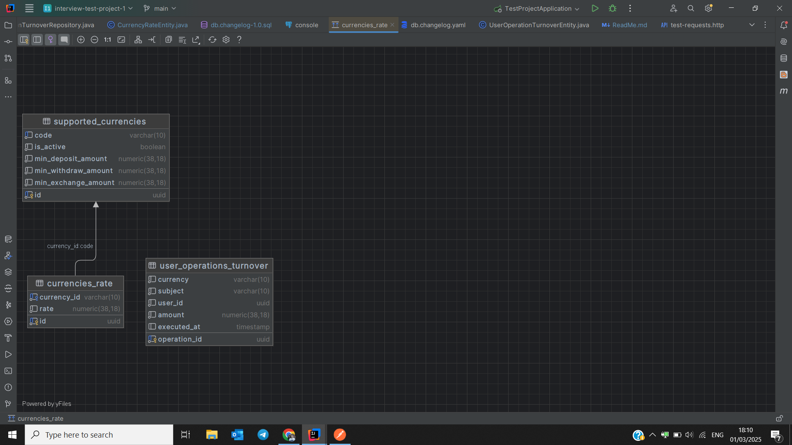

1. Информация по БД:



- Таблица supported_currencies хранит доступные валюты в системе
  - id - UUID primary key
  - code - VARCHAR(10) - уникальный ключ валюты
  - min_deposit_amount DECIMAL(38,18) NOT NULL DEFAULT 0, - минимальный объем для депозита
  - min_withdraw_amount DECIMAL(38,18) NOT NULL DEFAULT 0, - минимальный объем для снятия
  - min_exchange_amount DECIMAL(38,18) NOT NULL DEFAULT 0 - минимальный объем для обмена
- Таблица currencies_rate хранит курсы валют для с ссылкой на таблицу supported_currencies(code), где:
  - id - UUID primary key
  - currency_id - FOREIGN KEY to supported_currencies(id)
  - rate DECIMAL(38,18) - курс монеты
- Таблица user_operations_turnover хранит историю операций пользователей, причем поле currency хранить валюты
  которые 100% присуствуют в supported_currencies(code).
  - operation_id - UUID PRIMARY KEY 
  - currency - VARCHAR(10) код валюты, в которой была совершена операция
  - user_id - UUID ИД пользователя, который соврешил операцию
  - amount - DECIMAL(38,18) сумма сделки в натуральном выражении (если была сделана в XRP, то объект купленных или проданных XRP)
  - executed_at - TIMESTAMP NOT NULL время, когда была сделана операция

Дополнительная информация:
  - currencies_rate
    1) Курс валют type FIAT выражен в USD. (Например, 1 USD = 90 RUB)
    2) Курс валют type CRYPTO выражен в USDT (Например, 1 BTC = 62869.94 USDT)
    3) По умолчанию, что USD = USDT. USD и USDT также присуствуют в таблице рейтов (1 USD = 1 USD, 1 USDT = 1 USDT) для удобства
  - user_operations_turnover
    1) В таблице существуют два пользователя Существует в БД для пользователя:
       - 5c6569b5-57e8-45ab-a72f-ff7affbd874e
       - ee6c8623-02f5-438e-9c4d-24179da54307
    2) Данные сгенерированы для интервала от сейчас до 8 дней минус сейчас. Всего 100 000 записей

2. Задания:

Задание N1. 

Имеется метод, который периодично принимает информацию по доступным монетам в системе и их курсам. 
   Сервис должен:

       - Добавлять монеты их как выключенные, если их нет в системе
       - Если монета пришла, то проверять и обновлять информацию по ней
       - Если монета не пришла, но есть в бд, то принудительно выключать ее
   
   Сервис был написан недобросоветным разработчиком, который возможно не реализовал все бизнес требования. Вам необходимо изучить сервис и 
    проверить были ли реализованы все требования. Если какое-то требование не было реализовано, то вам необходимо имплементировать его. 
   
    
Задание N2.

Сделать контроллер для расчета недельного объема операций пользователя в валюте, которая приходит как параметр
   Требования:

       - Входит в группу /turnover  
       - Возвращает 200 статус код  
       - GET метод с энпоинтом /week
       - /week - это оборот за сейчас минус 7*24 часа
       - Принимает обязательный path параметр (user-id)  
       - Принимает обязательный query параметр (coin) который определяет валюту в который необходимо рассчитать объем операций (Если отправляется RUB, то сумма всех операций в рубле)
       - Ответ необходимо отправить объект с одним полем result в качестве числа выраженного в валюте, которая была прислала (coin).


Например:

Запрос GET /turnover/daily/ee6c8623-02f5-438e-9c4d-24179da54307?coin=BTC 

Ответ: 

```json
{
  "result": 134543.23543
}
```


3. Скрипт для генерации данных
```sql
CREATE OR REPLACE FUNCTION generate_user_operations_turnover_records()
    RETURNS void AS $$
DECLARE
    rec_currency RECORD;
    rec_type RECORD;
    currency_code TEXT;
    currency_type TEXT;
    random_amount NUMERIC;
    random_date TIMESTAMP;
    random_user_id UUID;
    i INTEGER;
BEGIN
    FOR i IN 1..100000 LOOP
            SELECT code, type INTO rec_currency
            FROM supported_currencies
            ORDER BY random()
            LIMIT 1;
            currency_code := rec_currency.code;
            currency_type := rec_currency.type;
            IF currency_type = 'FIAT' THEN
                random_amount := round(CAST(random() * 100000 AS numeric), 2);
            ELSE
                random_amount := round(CAST(random() * 100000 AS numeric), 8);
            END IF;
            random_date := NOW() - (random() * INTERVAL '8 days');
            random_user_id := CASE WHEN random() < 0.5
                                       THEN 'ee6c8623-02f5-438e-9c4d-24179da54307'::UUID
                                   ELSE '5c6569b5-57e8-45ab-a72f-ff7affbd874e'::UUID
                END;
            INSERT INTO user_operations_turnover (operation_id, currency, user_id, subject, amount, executed_at)
            VALUES (
                       gen_random_uuid(),           
                       currency_code,               
                       random_user_id,              
                       currency_type,               
                       random_amount,               
                       random_date                  
                   );
        END LOOP;
END;
$$ LANGUAGE plpgsql;

SELECT generate_user_operations_turnover_records();
```

4. SQL чтобы проверить результаты:
```sql
WITH target_currency_rate AS (
    SELECT cr.currency_id, cr.rate
    FROM currencies_rate cr
    WHERE cr.currency_id = 'USD' -- Указать целевую валюту (например, BTC)
)
SELECT tcr.currency_id, agr.total/tcr.rate as turnover FROM (SELECT SUM(sum * cr.rate) as total FROM (SELECT currency, Sum(amount) as sum
FROM user_operations_turnover
WHERE user_id = 'ee6c8623-02f5-438e-9c4d-24179da54307'
  AND executed_at >= now() - INTERVAL '1 days'
GROUP BY currency) tmp
LEFT JOIN currencies_rate cr ON tmp.currency = cr.currency_id) agr
CROSS JOIN target_currency_rate tcr;

WITH target_currency_rate AS (
    SELECT cr.currency_id, cr.rate
    FROM currencies_rate cr
    WHERE cr.currency_id = 'USD' -- Указать целевую валюту (например, BTC)
)
```


```json
{
  "coinList": [
    {
      "code": "ETH",
      "rate": 2850.75,
      "minDepositAmount": 0.01,
      "minWithdrawAmount": 0.02,
      "minExchangeAmount": 0.05,
      "maxExchangeAmount": 50.0
    },
    {
      "code": "BTC",
      "rate": 49500.25,
      "minDepositAmount": 0.0005,
      "minWithdrawAmount": 0.001,
      "minExchangeAmount": 0.002,
      "maxExchangeAmount": 10.0
    },
    {
      "code": "TON",
      "rate": 1.95,
      "minDepositAmount": 1.0,
      "minWithdrawAmount": 2.0,
      "minExchangeAmount": 5.0,
      "maxExchangeAmount": 1000.0
    },
    {
      "code": "MNT",
      "rate": 0.00035,
      "minDepositAmount": 500.0,
      "minWithdrawAmount": 1000.0,
      "minExchangeAmount": 2500.0,
      "maxExchangeAmount": 500000.0
    },
    {
      "code": "USDE",
      "rate": 1,
      "minDepositAmount": 10.0,
      "minWithdrawAmount": 20.0,
      "minExchangeAmount": 50.0,
      "maxExchangeAmount": 50000.0
    },
    {
      "code": "USD",
      "rate": 1,
      "minDepositAmount": 5.0,
      "minWithdrawAmount": 10.0,
      "minExchangeAmount": 25.0,
      "maxExchangeAmount": 25000.0
    },
    {
      "code": "RUB",
      "rate": 93,
      "minDepositAmount": 100.0,
      "minWithdrawAmount": 200.0,
      "minExchangeAmount": 500.0,
      "maxExchangeAmount": 1000000.0
    },
    {
      "code": "AED",
      "rate": 3.7,
      "minDepositAmount": 20.0,
      "minWithdrawAmount": 50.0,
      "minExchangeAmount": 100.0,
      "maxExchangeAmount": 100000.0
    },
    {
      "code": "EUR",
      "rate": 0.93,
      "minDepositAmount": 5.0,
      "minWithdrawAmount": 10.0,
      "minExchangeAmount": 25.0,
      "maxExchangeAmount": 20000.0
    },
    {
      "code": "KZT",
      "rate": 450,
      "minDepositAmount": 5000.0,
      "minWithdrawAmount": 10000.0,
      "minExchangeAmount": 25000.0,
      "maxExchangeAmount": 10000000.0
    },
    {
      "code": "KGS",
      "rate": 90,
      "minDepositAmount": 100.0,
      "minWithdrawAmount": 200.0,
      "minExchangeAmount": 500.0,
      "maxExchangeAmount": 500000.0
    },
    {
      "code": "USDT",
      "rate": 1,
      "minDepositAmount": 10.0,
      "minWithdrawAmount": 20.0,
      "minExchangeAmount": 50.0,
      "maxExchangeAmount": 100000.0
    }
  ]
}

```

