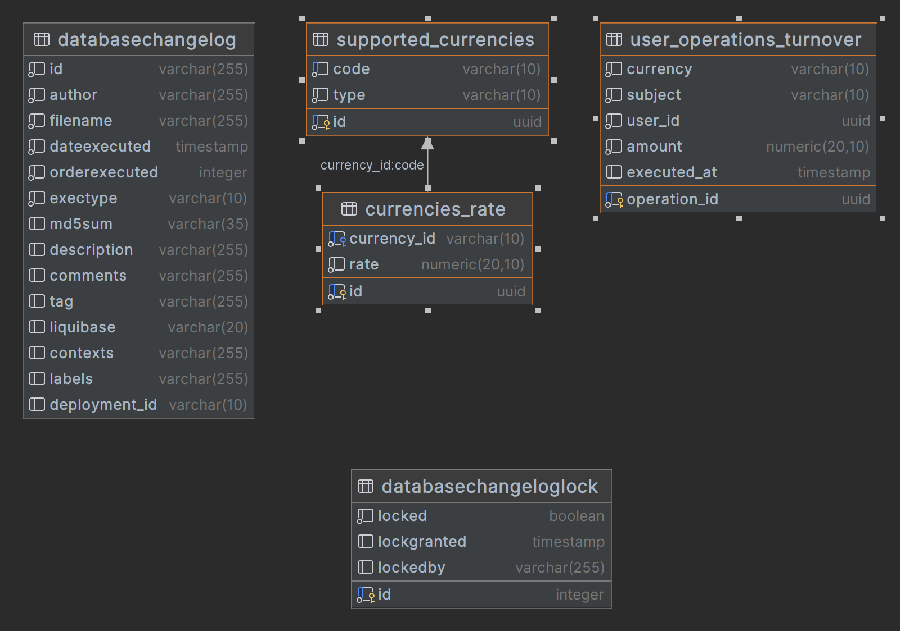

1. Информация по БД:


Таблица supported_currencies хранит доступные валюты в системе

Таблица currencies_rate хранит курсы валют для с ссылкой на таблицу supported_currencies(code), где:
1) Курс валют type FIAT выражен в USD
2) Курс валют type CRYPTO выражен в USDT
3) По умолчанию, что USD = USDT

Таблица user_operations_turnover хранит историю операций пользователей, причем currency это supported_currencies(code).
В таблице существуют два пользователя Существует в БД для пользователя ee6c8623-02f5-438e-9c4d-24179da54307, 5c6569b5-57e8-45ab-a72f-ff7affbd874e.
Данные сгенерированы для интервала от сейчас до 8 дней минус сейчас. Всего 100 000 записей

2. Задание:
 1) Сделать два контроллера для расчета дневного и недельного объема операций пользователя в валюте
    Требования:

        - Входит в группу /turnover  
        - Возвращает 200 статус код  
        - GET метод с энпоинтом /daily и /week
        - /daily оборот - это сейчас минус 24 часа, и /week - это оборот за сейчас минус 7*24 часа
        - Принимает обязательный path параметр (user-id)  
        - Принимает обязательный query параметр (coin) который определяет валюту в который необходимо рассчитать объем операций
        - Ответ необходимо отправить объект с одним полем result в качестве числа выраженного в валюте, которая была прислала (coin).


Например:

Запрос GET /turnover/daily/ee6c8623-02f5-438e-9c4d-24179da54307?coin=BTC 

Ответ: 

```json
{
  "result": 134543.23543
}
```

4. SQL чтобы проверить результаты:

```sql
WITH target_currency_rate AS (
    SELECT cr.currency_id, cr.rate
    FROM currencies_rate cr
    WHERE cr.currency_id = 'USD' -- Указать целевую валюту (например, BTC)
)
SELECT tcr.currency_id, agr.total/tcr.rate as turnover FROM (SELECT SUM(sum * cr.rate) as total FROM (SELECT currency, Sum(amount) as sum
FROM user_operations_turnover
WHERE user_id = 'ee6c8623-02f5-438e-9c4d-24179da54307'
  AND executed_at >= now() - INTERVAL '1 days'
GROUP BY currency) tmp
LEFT JOIN currencies_rate cr ON tmp.currency = cr.currency_id) agr
CROSS JOIN target_currency_rate tcr;

WITH target_currency_rate AS (
    SELECT cr.currency_id, cr.rate
    FROM currencies_rate cr
    WHERE cr.currency_id = 'USD' -- Указать целевую валюту (например, BTC)
)
SELECT tcr.currency_id, agr.total/tcr.rate as turnover FROM (SELECT SUM(sum * cr.rate) as total FROM (SELECT currency, Sum(amount) as sum
FROM user_operations_turnover
WHERE user_id = 'ee6c8623-02f5-438e-9c4d-24179da54307'
  AND executed_at >= now() - INTERVAL '7 days'
GROUP BY currency) tmp
LEFT JOIN currencies_rate cr ON tmp.currency = cr.currency_id) agr
CROSS JOIN target_currency_rate tcr;

WITH target_currency_rate AS (
    SELECT cr.currency_id, cr.rate
    FROM currencies_rate cr
    WHERE cr.currency_id = 'USD' -- Указать целевую валюту (например, BTC)
)
SELECT tcr.currency_id, agr.total/tcr.rate as turnover FROM (SELECT SUM(sum * cr.rate) as total FROM (SELECT currency, Sum(amount) as sum
FROM user_operations_turnover
WHERE user_id = 'ee6c8623-02f5-438e-9c4d-24179da54307'
GROUP BY currency) tmp
LEFT JOIN currencies_rate cr ON tmp.currency = cr.currency_id) agr
CROSS JOIN target_currency_rate tcr;
```
